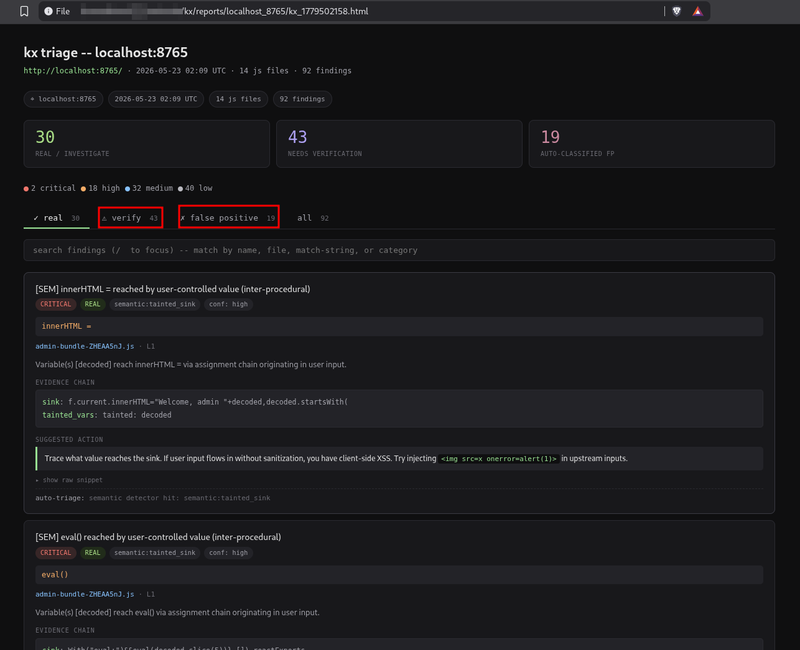
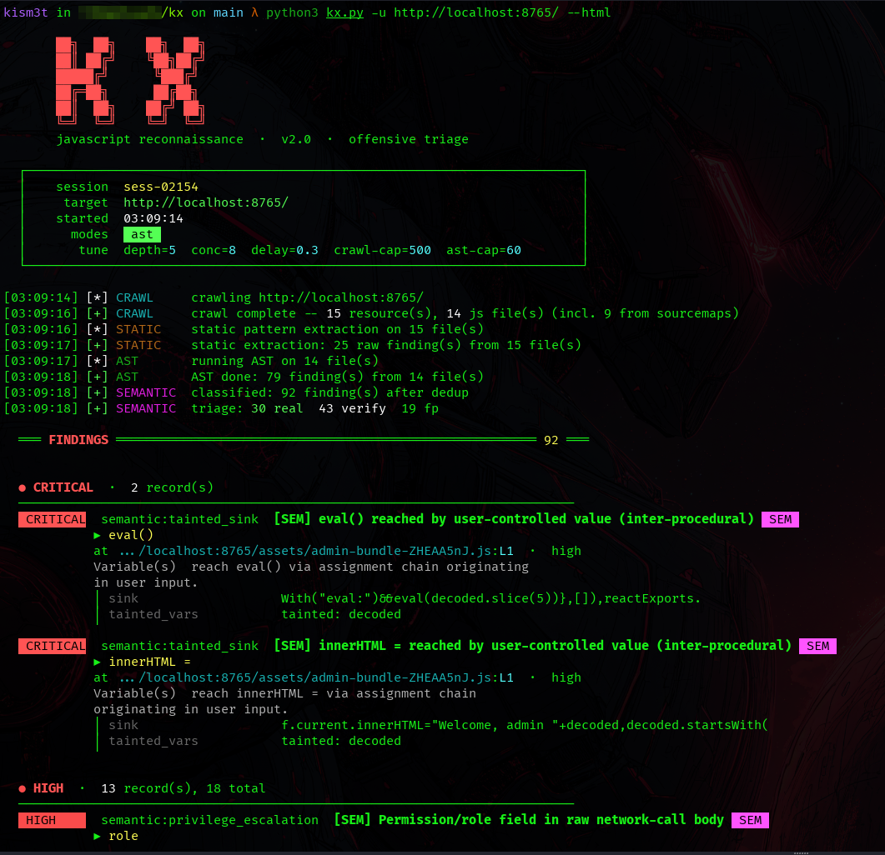
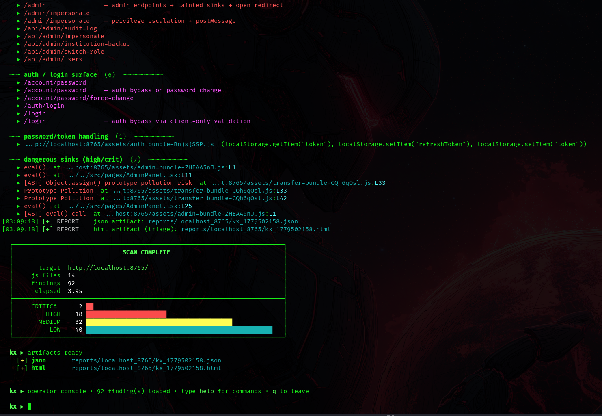

# kx - Semantic JS recon


kx maps a target's entire JavaScript attack surface -- including the lazy-loaded chunks and recovered sources most recon never sees -- then reads it for bug **classes**, not just patterns.

Most JS recon (jsluice, LinkFinder, SecretFinder) pulls endpoints and secrets out of the scripts a page links to. kx goes further: it parses the bundler's chunk manifest and force-loads every lazy route, reconstructs original TypeScript from sourcemaps, then builds a structural model of each file -- schemas, mutations, network calls, session refs, sinks, taint paths -- and reasons about whether the behaviour represents a real vulnerability. It works on production-minified code where every variable is a one-character alias.



*Triage HTML output: 92 findings auto-classified into real / needs-verification / false-positive, each with an evidence chain and a concrete next action.*

---

## What it finds

### Bug classes (semantic detectors)

- **Auth bypass via client-only validation.** A Zod/Yup field has a `.refine()` rule but the mutation payload omits it -> server never sees the check. Skip the modal, hit the endpoint directly.
- **IDOR / horizontal privilege escalation.** A mutation body contains `userId` / `merchantId` / `subscriptionId` sourced from props or URL params instead of the session.
- **SSRF via user-controlled URL.** A form field named `webhookUrl` / `notificationURL` / `callbackUrl` is transmitted to the backend without host validation.
- **Privilege escalation via client-controlled permission field.** A mutation includes `role`, `whoCanChange`, `isAdmin` etc. -- fields the server should derive, not accept.
- **Inter-procedural taint to sinks.** `location.hash -> x -> decodeURIComponent -> y -> eval(y)` traced through assignment chains. Not a regex; a real def-use walk.
- **Raw network calls with sensitive fields.** Same bug classes as above, surfaced via vanilla `fetch`/`axios` when no form/mutation hook is present.

### Pattern detectors (legacy, still useful)

Secrets, hardcoded URLs, dangerous sinks (`eval`, `innerHTML`, `postMessage` without origin check), debug flags, source-map references, prototype-pollution shapes, open redirects, hardcoded admin endpoints.

### Identification by usage shape, not name

Production bundles strip everything. kx doesn't grep for `"useForm"`, it identifies a form hook by detecting that something returns an object destructured into `{handleSubmit, control, ...}`. Same for schemas, mutations, sessions, resolvers. Works on react-hook-form, vee-validate, svelte-forms-lib, custom hooks, and anything else that follows these conventions.

### Coverage you don't have to click for

- **Chunk-manifest resolution.** kx parses Vite, Webpack, Rollup, and Next.js entry bundles for their chunk maps and force-fetches every lazy-loaded route. The admin panel chunk that only loads when you click "Settings -> Account", kx pulls it on first scan.
- **Source-map recovery.** Every `.js.map` is fetched, parsed, and original TypeScript sources are reconstructed and re-scanned. Third-party noise (react, lodash, polyfills) is filtered. Findings on recovered files are tagged `[src] path/to/Original.ts`.

### Optional LLM verification (any provider)

Pass `--verify` and the top semantic findings go to an LLM with their evidence chain and a code window. The model returns a verdict (`exploitable` / `false_positive` / `needs_testing`), a concrete PoC HTTP request, prerequisites, and chaining notes. Capped at 25 findings per run.

**Bring your own key, any provider.** kx auto-detects the provider from whichever API-key env var is set:

| Provider | Env var | Default model |
|----------|---------|---------------|
| Anthropic | `ANTHROPIC_API_KEY` | `claude-sonnet-4-6` |
| OpenAI | `OPENAI_API_KEY` | `gpt-4o-mini` |
| OpenRouter | `OPENROUTER_API_KEY` | `anthropic/claude-3.5-sonnet` |
| Groq | `GROQ_API_KEY` | `llama-3.3-70b-versatile` |
| DeepSeek | `DEEPSEEK_API_KEY` | `deepseek-chat` |
| Gemini | `GEMINI_API_KEY` | `gemini-2.0-flash` |
| Mistral | `MISTRAL_API_KEY` | `mistral-large-latest` |
| Together | `TOGETHER_API_KEY` | `meta-llama/Llama-3.3-70B-Instruct-Turbo` |

Pick explicitly with `--verify-provider`, override the model with `--verify-model`, and point at any OpenAI-compatible endpoint (incl. local Ollama / LM Studio) with `--verify-base-url`:

```bash
# Auto: uses whichever key is in your environment
export OPENAI_API_KEY=sk-...
kx -u https://target.com --verify

# Explicit provider + model
kx -u https://target.com --verify --verify-provider groq --verify-model llama-3.1-8b-instant

# Local Ollama (no key needed; OpenAI-compatible)
kx -u https://target.com --verify --verify-provider custom \
   --verify-base-url http://localhost:11434/v1/chat/completions --verify-model llama3.1
```

---

## Install

```bash
git clone https://github.com/kism3t/kx
cd kx && ./install.sh
```

Installer pins `kx` to `/usr/local/bin/kx` if writable, else `~/.local/bin/kx`.

Manual:
```bash
pip install -r requirements.txt --break-system-packages
playwright install chromium       # only needed for --runtime
cd ast_worker && npm install && cd ..
```

Requirements: Python ≥3.10, Node.js ≥18 (for the AST worker), `pip` access.

---

## Usage



*kx running against a Vite + React target. Crawl resolves the chunk manifest, AST analyzer fires on each file, semantic detectors classify findings into real/verify/fp before the report lands.*

```bash
# Basic scan
kx -u https://target.com

# Authenticated, with LLM verification + Markdown export
export ANTHROPIC_API_KEY=sk-ant-...
kx -u https://target.com \
  --auth "Cookie: session=abc123;; Authorization: Bearer eyJ..." \
  --verify \
  --markdown

# Full power -- semantic + runtime + diff + Burp + journal
kx -u https://target.com \
  --auth "Cookie: session=abc" \
  --runtime \
  --diff \
  --burp http://127.0.0.1:1337 \
  --journal ~/bugbounty/hunt_journal.md \
  --markdown

# Skip the heavy stuff for a fast pass
kx -u https://target.com --no-ast --no-source-maps

# Tune crawl behaviour and stay in scope
kx -u https://app.target.com \
  --scope target.com,cdn.target.com,api.target.com \
  --depth 8 --concurrency 15 --delay 0.5
```

---

## Flags

| Flag | Default | Description |
|------|---------|-------------|
| `-u`, `--url` | required | Target URL |
| `--auth` | - | Auth headers: `"Cookie: x=y;; Header: value"` |
| `--scope` | same origin | Comma-separated allowed domains |
| `--depth` | 5 | Max JS recursion depth |
| `--concurrency` | 8 | Parallel HTTP requests |
| `--delay` | 0.3 | Seconds between requests |
| `--no-source-maps` | off | Skip `.js.map` fetching/recovery |
| `--sourcemap-noise` | off | Include third-party recovered sources (very noisy) |
| `--no-ast` | off | Skip Node.js AST + semantic analysis |
| `--crawl-limit` | 500 | Max resources to fetch (`0` = unlimited). Caps runaway crawls on Vite/Next SPAs with thousands of chunks. |
| `--top` | -- | Global cap on findings printed per-tier. Default is adaptive: critical/high uncapped, medium ≤25, low ≤10. |
| `--show-all` | off | Disable all per-tier output capping. |
| `--insecure`, `-k` | off | Skip SSL cert verification (like `curl -k`). For targets with broken cert chains (banks, gov portals). |
| `--html` | off | Triage HTML report (verdict tabs, action lines, evidence chains). |
| `--html-legacy` | off | Use the old severity-sorted HTML instead of the triage view. |
| `--runtime` | off | Playwright runtime hooks (fetch, XHR, WebSocket) |
| `--no-headless` | off | Show browser (debug) |
| `--wait-ms` | 5000 | Runtime page wait |
| `--verify` | off | LLM verify top findings (needs any provider API key, see below) |
| `--verify-max` | 25 | Hard cap on LLM-verified findings per run |
| `--verify-provider` | `auto` | `auto` / `anthropic` / `openai` / `openrouter` / `groq` / `deepseek` / `gemini` / `mistral` / `together` / `custom` |
| `--verify-model` | provider default | Model name (overrides the provider's default) |
| `--verify-base-url` | - | OpenAI-compatible endpoint for `custom` provider (e.g. local Ollama) |
| `--diff` | off | Diff vs last scan, highlight new findings |
| `--db` | `~/.kx/state.db` | SQLite state DB |
| `-o`, `--output` | auto-named | JSON report path |
| `--markdown` | off | Also export Markdown |
| `--burp` | -- | Burp REST API URL |
| `--journal` | -- | Path to `hunt_journal.md` |

---

## Output



*Scan summary: 14 JS files, 92 findings in 2.1s. Endpoints are grouped by surface (admin, auth/login, password/token, dangerous sinks) so you know which areas to attack first.*

- **Terminal** - Severity-coloured table, then evidence panels for each high/critical semantic finding showing the schema field, refine rule, mutation payload, and origin chain that triggered it.
- **JSON** - Full findings with `note` and `evidence` arrays preserved.
- **Markdown** - Paste-ready for writeups, with a dedicated "Semantic findings - evidence chains" section detailing every high/critical finding.
- **Per-file Markdown reports** (`reports/<host>/<filename>.md`) - Hunter's notes per JS file: summary, schema, mutations, findings.
- **Burp sitemap** - Discovered endpoints pushed via REST API.
- **hunt_journal.md** - Auto-appended summary for session tracking.

Findings reconstructed from sourcemaps render as `[src] src/api/UserService.ts` instead of a mangled bundle URL.

---

## Operator console (REPL)

After a scan, kx drops into an interactive console for triage. `kx ►` prompt.

```
kx ► show high               # filter findings by severity
kx ► show idor               # filter by category substring
kx ► file impersonate        # findings whose source URL matches pattern
kx ► open 14                 # open file in $EDITOR at finding's line
kx ► curl 14 --auth          # generate curl command, attach cookie from $KX_COOKIE
kx ► curl 14 --proxy 127.0.0.1:8080   # route through Burp
kx ► poc 14                  # generate PoC via Claude (needs ANTHROPIC_API_KEY)
kx ► triage 14 hit           # mark as confirmed finding
kx ► triage 14 fp            # mark as false positive
kx ► save                    # persist triage marks to reports/<host>/.kx_session.json
kx ► load                    # restore triage marks from prior session
kx ► history                 # show prior scans of this target from diff DB
kx ► help                    # full command reference
```

Triage state survives across scans - finding fingerprints match by content, not ID, so re-runs preserve your marks even when the bundle layout shifts.

The `curl <id>` command tailors its hint to the finding category - admin paths get "expect 302 -> /login if authz works", IDOR gets "change the ID to another tenant", SSRF gets the cloud-metadata trick, etc.

---

## Triage HTML report

`--html` generates a self-contained HTML file that sorts findings by **verdict** (real / verify / fp) rather than severity. Each finding card includes:

- Severity + verdict + category badges
- The match string in a highlighted code box
- Source file + line number
- Evidence chain from semantic detectors (schema field, mutation call, spread member, etc.)
- **Suggested action box** - category-specific verification instructions
- Auto-triage rationale (why it was classified)

Findings get auto-classified by `auto_triage.py`: React/Next/Redux framework noise -> `fp`, semantic detector hits -> `real`, everything else -> `verify`. You can re-classify in the REPL with `triage <id> hit/fp/verify`.

---

## Architecture

```
kx.py                       CLI orchestrator
crawler.py                  Async httpx crawler + manifest discovery + sourcemap recovery
chunk_manifest.py           Vite/Webpack/Rollup/Next chunk-map parser
sourcemap_recover.py        .js.map -> original source files (with noise filter)
extractor.py                Static regex extraction
patterns/signatures.py      60+ regex signatures (severity-tiered)
ast_worker/
  analyze.js                Legacy AST detectors + entrypoint
  semantic_model.js         Schemas / mutations / sessions / sinks / props extraction
  detectors.js              Bug-class detectors over the semantic model
  taint.js                  Fixed-point inter-procedural taint
classifier.py               AST subprocess driver + dedup + scoring
auto_triage.py              Heuristic verdict engine (real/verify/fp)
triage_report.py            Triage HTML report (verdict tabs, action lines)
verifier.py                 Optional LLM verification + PoC generation
runtime.py                  Playwright runtime hooks
differ.py                   SQLite diff engine (with legacy ~/.wraith migration)
repl.py                     Operator console (curl/poc/triage/history/save/load)
reporter.py                 Rich terminal + JSON + Markdown export + legacy HTML
file_reports.py             Per-file hunter's-notes Markdown generator
integrations/burp.py        Burp REST API push
integrations/journal.py     hunt_journal.md append
```

---

## Extending signatures

Pattern signatures live in `patterns/signatures.py` (one Python list, easy to edit). Each is:

```python
dict(
    name="My Custom Token",
    pattern=r"myapp_[A-Za-z0-9]{32}",
    severity="high",
    context="myapp",
)
```

Severity tiers: `critical` -> `high` -> `medium` -> `low`.

For *semantic* bug classes (not pattern signatures), add detector functions to `ast_worker/detectors.js`. Each takes the model and returns findings. See the existing six for the pattern.

---

## Tips for bug bounty

- Always run **authenticated** (`--auth "Cookie: ..."`) - post-login bundles contain different schemas, mutations, and admin chunks.
- Let kx do the work: it now fetches lazy routes via manifest parsing and reconstructs original sources from maps. You don't have to click through.
- Pair with `--diff` weekly on active programs - new deploys = new attack surface, often new bugs introduced.
- `--verify` is worth the few cents per scan when triaging - it culls FPs and gives you ready-to-paste PoCs.
- Use `--runtime` to capture dynamically constructed URLs static analysis can't see.
- Pipe `--burp` to push every endpoint discovered (including ones from recovered source) directly into Burp.
- For targets with broken SSL chains (banks, gov portals), pass `--insecure` -- the diagnostic will tell you when this is needed.
- The triage HTML report (`--html`) is the fastest way to skim 200+ findings -- `real` tab first, ignore `fp`, drill into `verify`.

---

## License

[MIT](LICENSE) - © 2026 kism37.

## Author

Built by [kism3t](https://github.com/kism37).
